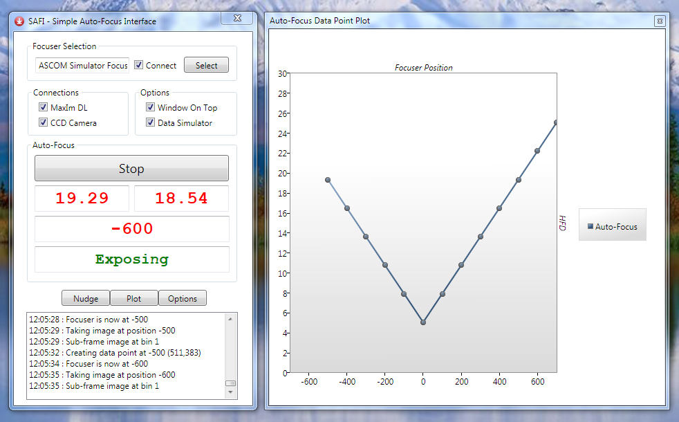

# Safi

Simple Auto-Focus Interface

**Archived Visual Studio 2010 project that was previously held in Team Foundation Server**

SAFI was designed to be a very simple auto-focus app, for use with the non-absolute positioning type of focuser used on the Meade LX200.

As it currently stands, SAFI offers no advantage over the standard FocusMax application. This is pretty much what I anticipated when I started the project. However, I approached the development of SAFI as an experiment and a learning process, and in that respect it has been useful. I offer the source code for SAFI in the same spirit, and it may help to illustrate by example concepts such as:

* Connecting to the MaxIm DL COM interface
* Using MaxIm objects to take images
* Working with ASCOM in C# and .NET
* Working with the ASCOM Focuser interface
* Creating on-the-fly graphical data plots
* Creating WPF clients and using techniques such as multi-threading
* XAML data binding

## Technical Details
* Developed in Microsoft Visual Studio 2010 using C# and the Windows Presentation Foundation (WPF).

## Requirements
* Visual Studio 2010
